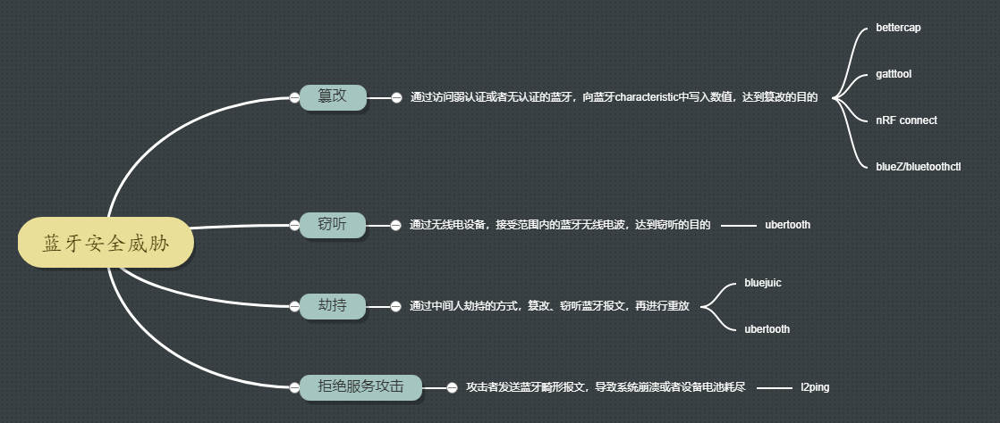
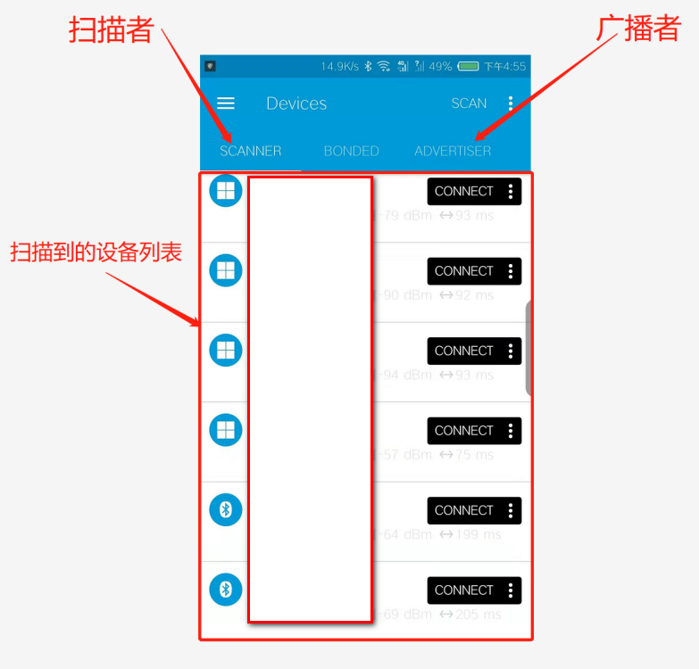
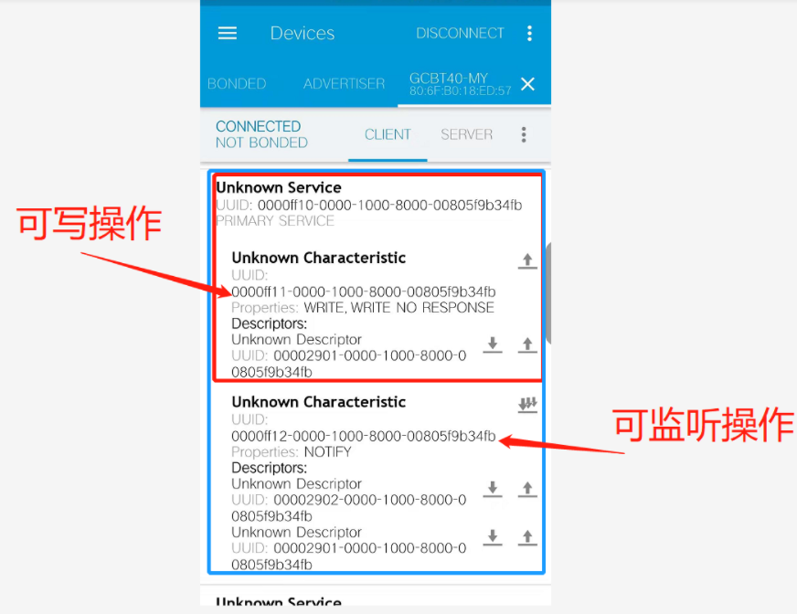
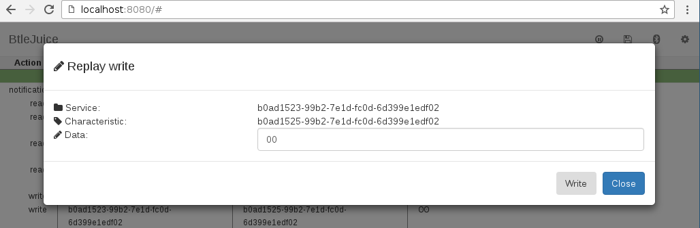

# 蓝牙渗透



## blueZ/bluetoothctl

**下载地址：**

​	http://www.bluez.org/download/

**使用简介：**

​	blueZ为linux提供了蓝牙协议栈，在安装好blueZ协议栈后，提供该协议栈的实用程序bluetoothctl，利用该工具可以发送蓝牙报文。

```
开启扫描功能：
	[bluetooth]# scan on
和指定的蓝牙设备配对：
	[bluetooth]# pair 78:4F:43:xx:xx:xx
和指定的蓝牙设备连接：
	[bluetooth]# connect 78:4F:43:xx:xx:xx

```


## gatttool

**下载地址**

​	http://manpages.ubuntu.com/manpages/cosmic/man1/gatttool.1.html

**使用简介：**

​	利用gatttool可以来对ble设备的att属性执行读取、写操作。

​	

```
gatttool -b 78:4F:43:xx:xx:xx -I 进入interactive模式与指定蓝牙设备通讯

>connect                      与BLE设备连接。

>primary                      寻找BLE中可用的服务。

>characteristics                查看设备服务的特征值。

>char-read-hnd 0x0009         读取特征值对应句柄的数值。

>char-write-cmd 0x0053 03      发送03命令到句柄0x0023

>sec-level high                 设置安全等级为高，可以让长时间与蓝牙设备保持连接。
```


## nRF connect

**下载地址：**

​	https://play.google.com/store/apps/details?id=no.nordicsemi.android.mcp&hl=zh&gl=US

**使用简介：**

​	该应用是一款手机app，利用该app可以实现蓝牙的scanner和adverter两种角色，同时也能对ble设备的att进行读写。

​	**设备发现/角色设置：**



​	**读取/设置att值：**

​										

## bettercap

**下载地址：**

​	https://github.com/bettercap/bettercap

**使用简介：**

​	**以ble模块为例**

```
开启ble蓝牙信号嗅探：
	ble.recon on
	
展示已嗅探到的ble蓝牙设备
	ble.show
	
枚举ble设备的属性值
	ble.enum MAC
	> ble.enum 04:52:de:ad:be:ef
	
向ble属性值写入字符
	ble.write MAC UUID HEX_DATA
	> ble.write 04:52:de:ad:be:ef 234bfbd5e3b34536a3fe723620d4b78d ffffffffffffffff
```


## ubertooth

**下载地址：**

​	https://github.com/greatscottgadgets/ubertooth

**使用简介：**

​	ubertooth用于空口对ble蓝牙信号的嗅探，重放等，可用于中间人攻击。

​	**更新ubertooth one 固件**

```
ubertooth-dfu -d bluetooth_rxtx.dfu -r
```

​	**验证ubertooth one 固件版本**

```
ubertooth-util -v
```

​	**ble设备嗅探**

```
ubertooth-rx
	systime=1578428685 ch=26 LAP=3a5138 err=1 clkn=8355 clk_offset=5199 s=-80 n=-55 snr=-25
	systime=1578428688 ch=26 LAP=3a5138 err=1 clkn=18479 clk_offset=5628 s=-81 n=-55 snr=-26
	systime=1578428692 ch=43 LAP=3a5138 err=2 clkn=28967 clk_offset=6029 s=-80 n=-55 snr=-25
	systime=1578428692 ch=47 LAP=3a5138 err=2 clkn=30327 clk_offset=6069 s=-81 n=-55 snr=-26
	systime=1578428694 ch=52 LAP=3a5138 err=1 clkn=36948 clk_offset=87 s=-79 n=-55 snr=-24
	systime=1578428696 ch=53 LAP=3a5138 err=0 clkn=42360 clk_offset=302 s=-77 n=-55 snr=-22
```

​	**空口数据报文抓取**

```
抓取指定地址的数据报文
	ubertooth-btle -f <BD_ADDR>
抓取指定地址的报文，并保存到本地
	ubertooth-btle -f <BD_ADDR> -c <file or pipe>
```


## bluejuice

**下载地址：**

​	https://github.com/DigitalSecurity/btlejuice

**使用简介：**

​	bluejuice用于对ble设备的中间人攻击，通过interception core和interception proxy实现蓝牙流量的截取和重放。

​	**对GATT值进行重放**

​	

​	

## l2ping

**下载地址：**

​	https://github.com/pauloborges/bluez/blob/master/tools/l2ping.c

**使用简介：**

```
泛洪攻击
	l2ping -f <MAC address>
```

